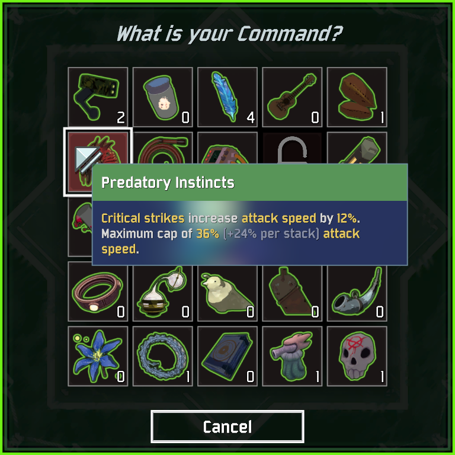
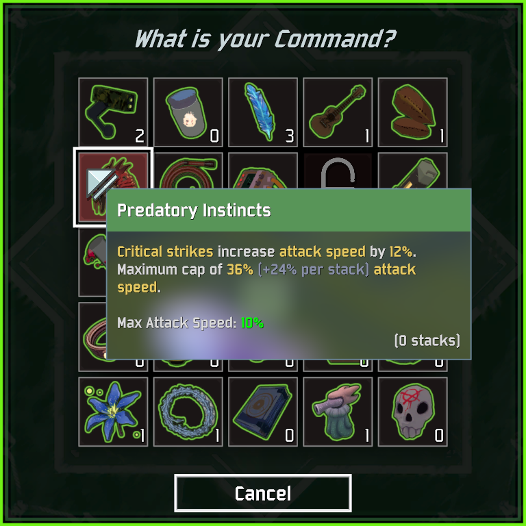

# BetterCommandMenu
Various quality of life improvements to the RoR2 command and scrapper menus.

<table>
    <tr>
        <th>Normal</th>
        <th>With <a href="https://thunderstore.io/package/ontrigger/ItemStatsMod/">ItemStatsMod</a></th>
    </tr>
    <tr>
        <td></td>
        <td></td>
    </tr>
</table>

## Features
- Shows item names and statistics on hover
- Displays a counter to show how many of each item you have
- Allows you to close menus with the escape key
- Optional protection settings to keep you safe while deciding at the command menu (off by default / configurable)
## Installation
Copy `BetterCommandMenu.dll` to your `BepInEx/plugins` folder. It requires [BepInEx](https://thunderstore.io/package/bbepis/BepInExPack/) and [R2API](https://thunderstore.io/package/tristanmcpherson/R2API/) to be installed. If you have any trouble installing, use the mod manager [r2modman](https://thunderstore.io/package/ebkr/r2modman/).
## Configuration
Creates a config file in `BepInEx/config` on first load. Configurable includes...

- Font size, color, border, and alignment options for item counters are all configurable. Here are some examples of what you can do with the configuration.

    - 
- Various options to configure protection. Each clients protection settings are honored in multiplayer
- Enable/Disable flags for every feature
## Integrations
-  [ItemStatsMod](https://thunderstore.io/package/ontrigger/ItemStatsMod/) - Will display the statistics from ItemStatsMod if enabled
## Notes
- Servers will honor each clients protection settings. This was so each player could specify an amount they are comfortable with. New players might spend a lot more time in the command menu looking at descriptions / stats.
## Changelog
### 1.3.0
- Added protection system with 3 initial protection types
- Added many more configuration options, and enable/disbale flags for all features
### 1.2.0
- Added abilty to press escape to close menus
### 1.1.0
- Tweaks to configuration options
### 1.0.1
- Fixed tooltip not showing up on equipment
### 1.0.0
- Initial release. Moved from HoverStats. Added configuration options