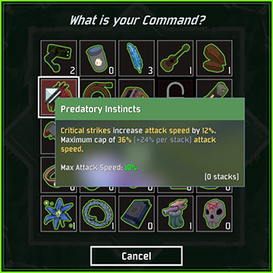

# BetterCommandMenu
Various quality of life improvements to the command and scrapper menus. This is a client side mod and does not need to be installed by the host or the server.
## Features
- Shows item names and statistics on hover
- Displays a counter to show how many of each item you have
- Allows you to close menus with the escape key
- Many optional tweaks to UI appearance

    - Disable the blur effect so you can see your health/buffs
    - Change the colors of all buttons (background, hover color, click color)
    - Offset the command menu to position it wherever you want on the screen
    - Disable any aspect of the command window. Hide the cancel button, background, etc.

## Installation
Copy `BetterCommandMenu.dll` to your `BepInEx/plugins` folder. It requires [BepInEx](https://thunderstore.io/package/bbepis/BepInExPack/) and [R2API](https://thunderstore.io/package/tristanmcpherson/R2API/) to be installed. If you have any trouble installing, use the mod manager [r2modman](https://thunderstore.io/package/ebkr/r2modman/).

## Configuration
Creates a config file in `BepInEx/config` on first load. Configurable options include...

- Font size, color, border, and alignment options for item counters (colors are stored in an RGBA format). Here are some examples of what you can do.

    - 

- Various UI settings allowing you to customize many aspects. Here is an example with the command menu moved to be over the health bar, with the blur/label/cancel button, and other decorations removed.

    - 

- Enable/Disable flags for every feature

## Integrations
-  [ItemStatsMod](https://thunderstore.io/package/ontrigger/ItemStatsMod/) - Will display the statistics from ItemStatsMod in tooltips if enabled

    - |Normal|ItemStatsMod|
      |------|------------|
      |||

## Notes
- The protection functionality has been moved to another mod. This was so people could get the UI improvements, while still maintaining the vanilla aspect of the game. It is located [here](https://thunderstore.io/package/mries92/SafeMenus/).
- Color values in the config are stored as RGBA hex values. For example, a semi-tranparent pure blue would be '0000FFB4'
## Changelog
### 1.6.1
- Fixed default button colors to match vanilla exactly
- Doing colors in a less hacky way now
- Added color options for on press and on hover
### 1.6.0
- Added more configuration options for buttons. Can now specify colors for borders and backgrounds.
- Started adding interop methods so other mods can use the same tooltip / counter settings.
### 1.5.0
- Now marked as a client side mod. Others in the lobby do not need to have it.
- Added option to disable ItemStatsMod info in tooltips (still shows up in inventory)
- Fixed - If offset is applied, blur is automatically removed.
### 1.4.1
- Split protection functionality to a new mod
### 1.4.0
- Added support for servers to force client protection settings
- Fixed shield protection amount
- Added option to hide counters when you have none of that item
- Added offset values to item counters so you can correct slight errors in your setup
- Added options to tweak command menu appearance

    - Remove blur behind command menu
    - Remove background from command menu
    - Remove spinning decoration around command menu
    - Remove the color overlay on the menu indicating the rarity
    - Remove the cancel button
    - Remove the 'What is your command?' label
    - Change position of command window through offsets

- Fixed bug where protection was being applied multiple times

### 1.3.0
- Added protection system with 3 initial protection types
- Added many more configuration options, and enable/disbale flags for all features
### 1.2.0
- Added abilty to press escape to close menus
### 1.1.0
- Tweaks to configuration options
### 1.0.1
- Fixed tooltip not showing up on equipment
### 1.0.0
- Initial release. Moved from HoverStats. Added configuration options